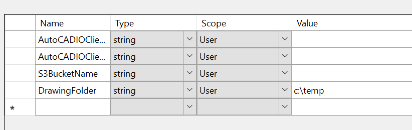
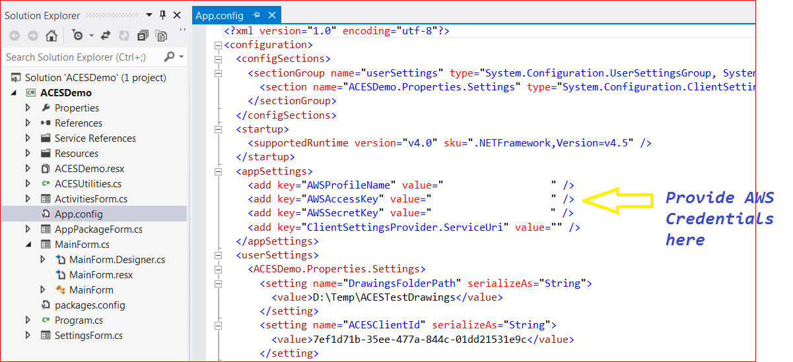
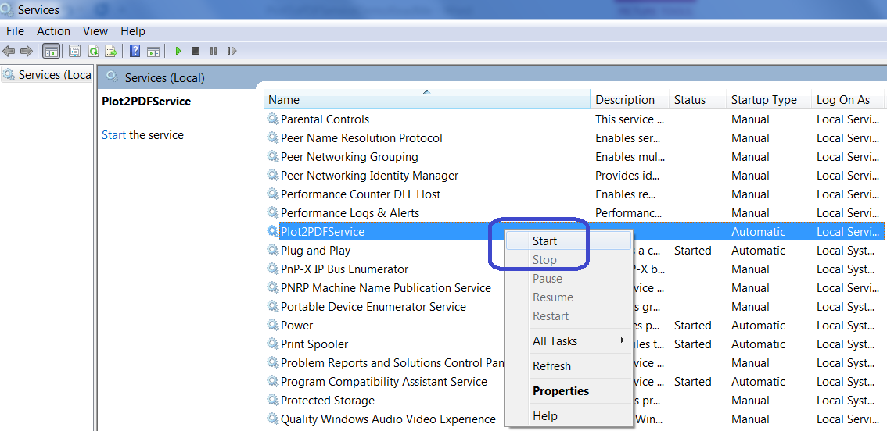
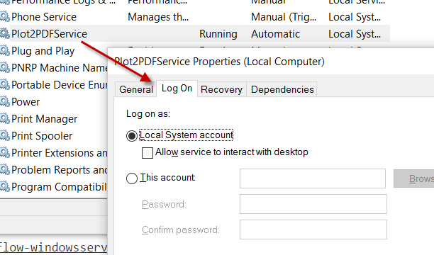
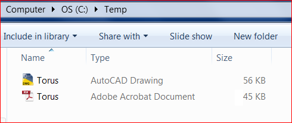

# Sample of Windows Service by Design Automation API
(Formely AutoCAD I/O)

##Description
Windows service sample to plot a drawing placed in a folder using Design Automation API
 
##Dependencies
* As this sample includes a reference to  [design.automation-.net-library](https://github.com/Developer-Autodesk/design.automation-.net-library), please build that sample firstly  
* Visual Studio 2012. 2013 or 2015 should be also fine, but has not yet been tested.
* Get [credentials of AWS](http://docs.aws.amazon.com/general/latest/gr/aws-security-credentials.html) and create one S3 bucket
* Get your credentials for Design Automation API at http://developer.autodesk.com

##Setup/Usage Instructions
* Build the library project [design.automation-.net-library](https://github.com/Developer-Autodesk/design.automation-.net-library)
* Open the PlotToPDFService sample project in Visual Studio 2012
* Restore the packages of the project by [NuGet](https://www.nuget.org/). The simplest way is to Projects tab >> Enable NuGet Package Restore. Then right click the project>>"Manage NuGet Packages for Solution" >> "Restore" (top right of dialog)
* Add other missing references and the library (AutoCADIOUtil) of [design.automation-.net-library](https://github.com/Developer-Autodesk/design.automation-.net-library)
* In the project settings, provide the following details:
 * Path to a local folder in your system that contains AutoCAD drawings.
 * Design Automation Client Id
 * Design Automation Client Secret
 * Bucket name in your AWS S3 Storage
 

 
* Open “App.Config” file and provide AWS credentials. This will allow the sample project to access S3 storage in your AWS profile.
 

 
* Build the sample project

* Install the windows service using “installutil”. To do this open Visual studio command prompt and run : installutil <path to PlotToPDF.exe”

* Start the windows service. To do this from the Run windows, type services.msc and look for Plot2PDFService and start it.

* You may need to switch to "[Log on local system account" of the service if you hit an error of "Access Denied".

* Copy any drawing to the watched folder (C:\Temp by default). After some time, a PDF of the same name should be available in the watched folder.

